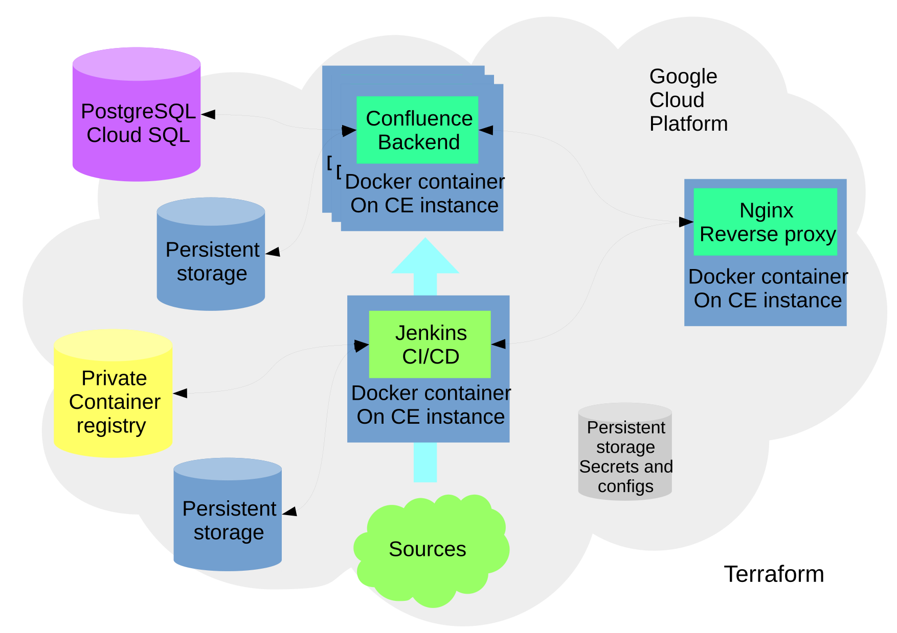

<<<<<<< HEAD
# Atlassian Confluence Cloud deployment

### Set up automated Atlassian Confluence deployment and CI/CD


## Requirements:
=======
#Atlassian Confluence Cloud deployment

###Set up automated Atlassian Confluence deployment and CI/CD


##Requirements:
>>>>>>> 387f7e4ac00be5a89d88d8230377de26b9f49c55
    Docker (18.06)
    Terraform (11.10)
    Google Cloud SDK (218.0.0)

<<<<<<< HEAD
## Initial Setup:
=======
##Initial Setup:
>>>>>>> 387f7e4ac00be5a89d88d8230377de26b9f49c55
    Create project using GCP Console
    Create service account for project with role "Owner"
    Setup authentication for Terraform using json-file
    -  download json using GCP Console
    -  export GOOGLE_APPLICATION_CREDENTIALS="<<path-to-json-file>>"

<<<<<<< HEAD
## How to run:
=======
##How to run:
>>>>>>> 387f7e4ac00be5a89d88d8230377de26b9f49c55
```
cd infrastructure/terraform
terraform apply
```

<<<<<<< HEAD
## Project structure
=======
##Project structure
>>>>>>> 387f7e4ac00be5a89d88d8230377de26b9f49c55



## Folder structure:
docker.img     - Dockerfiles and all stuff needed for images
infrastructure - Infrasturucture creation scripts (terraform, etc)
misc           - Additional files
pipelines      - Jenkins pipelines
scripts        - Additional scripts
